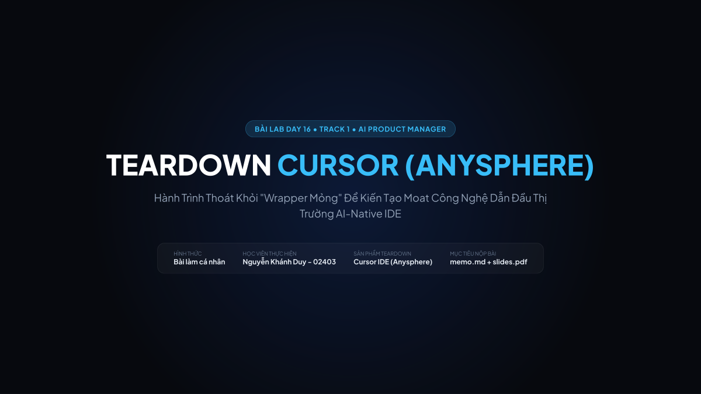
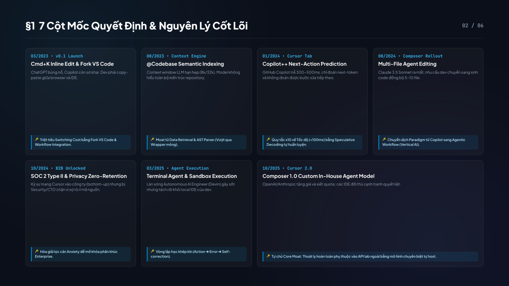
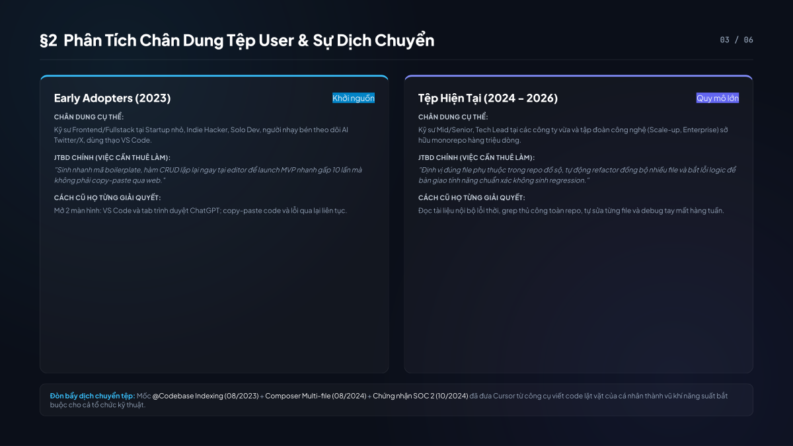
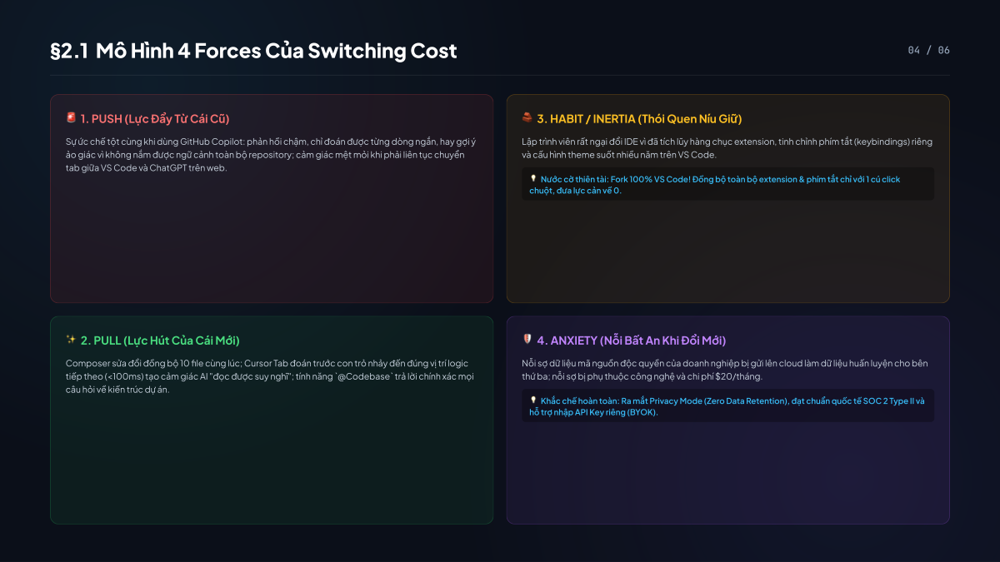
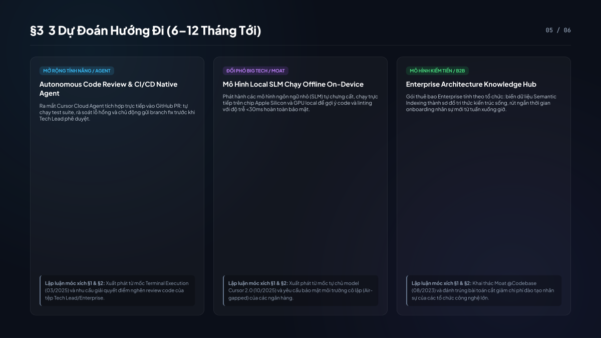
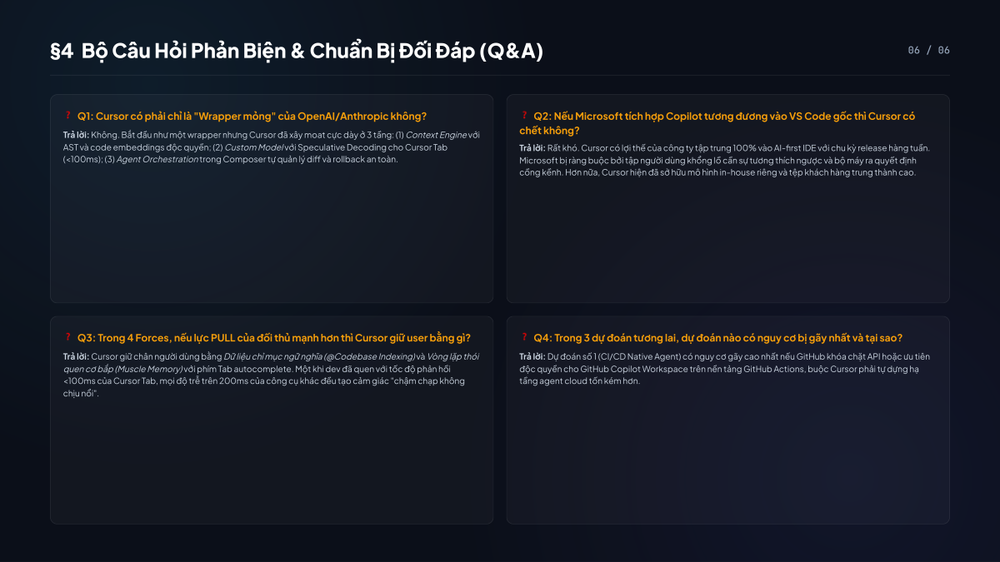

# Bài Lab Day 16: Teardown Sản Phẩm AI (Cursor IDE - Anysphere)

> **Khóa học:** AI Product Manager (Track 1 - Day 16)  
> **Hình thức:** Bài làm cá nhân  
> **Học viên thực hiện:** Nguyễn Khánh Duy (Mã HV: 02403)  
> **Hạn chót nộp bài:** 03/10/2026 11:59 (GMT+7)

---

## 📌 Tổng Quan Bài Nộp

Bài lab thực hiện **Teardown chuyên sâu sản phẩm Cursor IDE (Anysphere)** nhằm làm sáng tỏ hành trình chuyển dịch từ một "wrapper mỏng" sang một nền tảng AI-native có hàng rào phòng thủ (moat) công nghệ vững chắc, phân tích bài toán switching cost và đưa ra các dự đoán chiến lược trong 6–12 tháng tới.

### 📂 Danh Sách Tài Liệu Chính Thức

1. **[memo.md](./memo.md)**: Bản Memo phân tích chi tiết đầy đủ 4 phần (3–5 trang chuẩn):
   * **§1. Timeline 7 Cột Mốc Quyết Định**: Từ launch v0.1 (03/2023) đến Cursor 2.0 In-house Model (10/2025), revert về các nguyên lý cốt lõi (*x10 Rule, Moat từ Context Retrieval, Fork VS Code để giảm switching cost, Vertical AI, Autonomous Feedback Loop*).
   * **§2. Phân Tích Tệp User & JTBD**: So sánh Early Adopters vs. Tệp Hiện Tại; phân tích ma trận 4 Forces (*Push, Pull, Habit, Anxiety*).
   * **§3. Ba Dự Đoán Hướng Đi (6–12 tháng tới)**: Autonomous CI/CD Agent, Local SLM On-Device, và Enterprise Knowledge Hub.
   * **§4. Bảng Khai Báo AI Log**: Minh bạch ranh giới giữa phần việc AI hỗ trợ và phần học viên kiểm chứng, phản biện.
2. **[slides.pdf](./slides.pdf)**: Slide thuyết trình chuẩn tỉ lệ 16:9 (6 trang), thiết kế hiện đại, sẵn sàng cho buổi thuyết trình và phản biện trước lớp.
3. **[slides.html](./slides.html)**: Mã nguồn giao diện slide (HTML/CSS) dùng để xuất bản và tùy biến slide.

---

## 🖼️ Xem Trước Slide Thuyết Trình

| Slide 1: Bìa Báo Cáo | Slide 2: Timeline & Nguyên Lý |
|---|---|
|  |  |

| Slide 3: Chân Dung User & JTBD | Slide 4: Mô Hình 4 Forces |
|---|---|
|  |  |

| Slide 5: Ba Dự Đoán Tương Lai | Slide 6: Bộ Câu Hỏi Phản Biện (Q&A) |
|---|---|
|  |  |

---

## 🛠️ Hướng Dẫn Xem & Tùy Chỉnh

* **Xem Memo:** Mở trực tiếp file `memo.md` trên GitHub hoặc bất kỳ Markdown reader nào.
* **Xem Slide:** Mở file `slides.pdf` hoặc xem trực tiếp `slides.html` bằng trình duyệt web Google Chrome.
* **Biên dịch lại PDF từ HTML:**
  ```bash
  /Applications/Google\ Chrome.app/Contents/MacOS/Google\ Chrome --headless --disable-gpu --print-to-pdf=slides.pdf --no-pdf-header-footer slides.html
  ```
